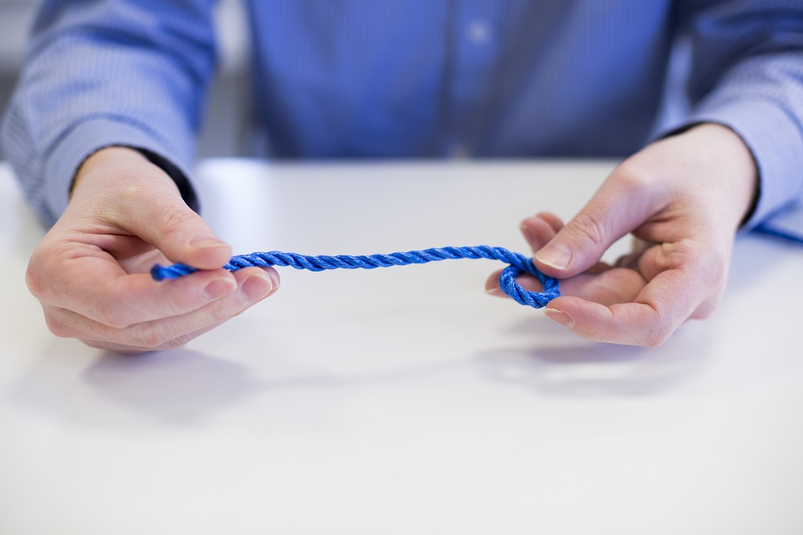

## First create a loop

Create a loop in the end of the rope with the loose end going over the long end. This isn’t the final loop we’re creating, it’s part of the knot, so keep this around 2 or 3cm in diameter.

