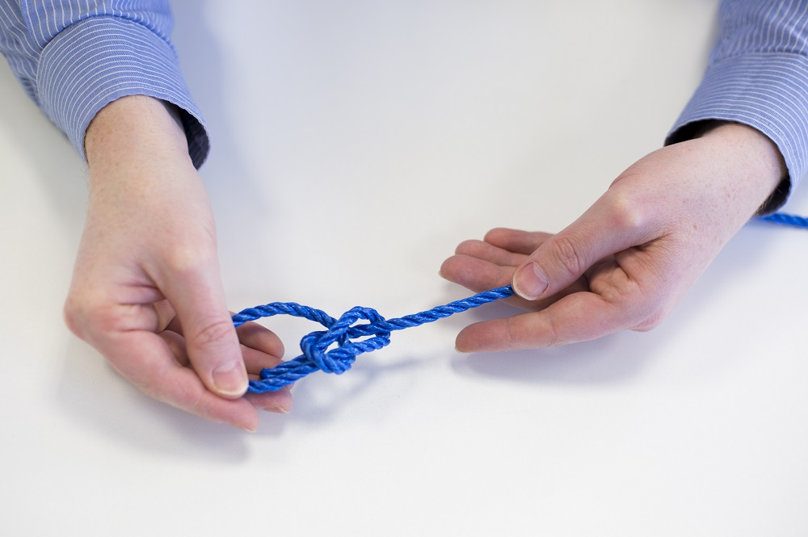

##Completing the knot

Move the loose end under the long end and back down through the loop. It should sit alongside the rope that went through the loop in the previous step.

Pull the knot tight and you now have your completed bowline.

